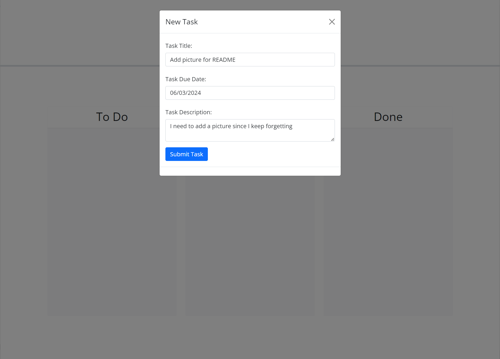
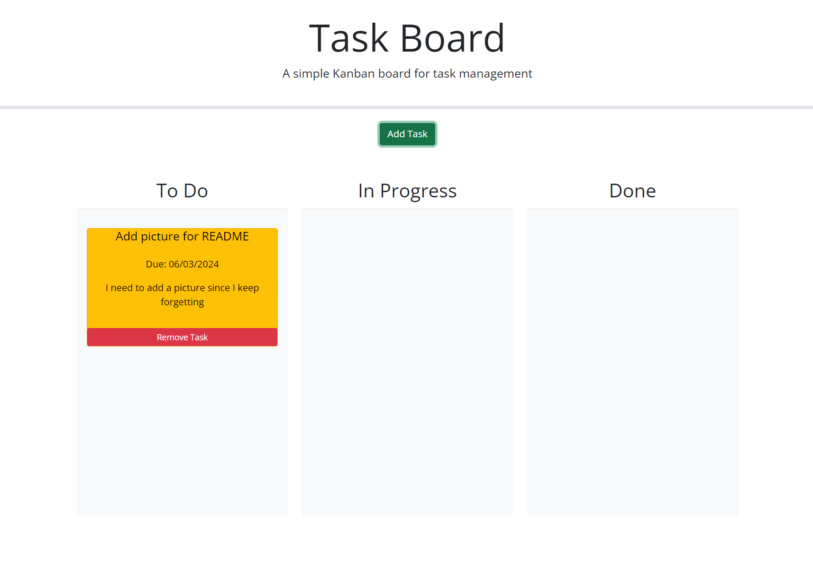

# Task Board Project (Week 5)

## What is This Project?

This week's project is a Task Board application designed to help a team manage project tasks.

- **Why Did I Make This?**: To practice and enhance my skills in JavaScript, jQuery and a little bit of Bootstrap, by creating a dynamic and interactive task management application. This project also taught me more about using the Day.js library for date manipulation and jQuery UI for drag-and-drop functionality.
- **What's in It?**: The application includes a main page where tasks can be added, viewed, and managed. Users can add new tasks, delete existing tasks, and drag tasks between different columns representing their progress (To-Do, In Progress, and Done). The task cards are color-coded based on their due dates, providing visual indicators for task urgency.
- **What Did I Learn?**: This project helped me understand the integration of various JavaScript libraries and the importance of debugging for a better user experience in web applications. I learned about DOM manipulation, handling local storage, implementing and debugging drag-and-drop functionality, and maintaining consistent styling. 

## Table of Contents

Explore the contents of this guide:

- [Installation](#installation)
- [Usage](#usage)
- [Screenshots](#screenshots)
- [Credits](#credits)
- [License](#license)

## Installation

No installation is required:
1. Open up the page on your favorite browser: [Task Board Project](https://kitkatkernel.github.io/Task-Board-Project/)

## Usage

1. Use the form to add a task with a title, due date, and description.
2. View tasks in their respective columns based on their status (To-Do, In Progress, Done).
3. Drag tasks between columns to update their status.
4. Delete tasks by clicking the "Remove Task" button on each task card.
5. Tasks are saved in localStorage and will be re-rendered between page reloads.

## Screenshots

#### Main Page

#### Task Management

## Credits

A heartfelt thank you to my bootcamp instructors and peers for their continuous guidance and support. Special thanks to W3schools and MDN for their comprehensive resources on JavaScript. The tutorials and documentation from these sites were invaluable in helping me understand various concepts like local storage keys, using JSON.stringify, and implementing the functionality for this project.

## License

MIT License 

Permission is hereby granted, free of charge, to any person obtaining a copy of this software and associated documentation files (the "Software"), to deal in the Software without restriction, including without limitation the rights to use, copy, modify, merge, publish, distribute, sublicense, and/or sell copies of the Software, and to permit persons to whom the Software is furnished to do so, subject to the following conditions:

The above copyright notice and this permission notice shall be included in all copies or substantial portions of the Software.

THE SOFTWARE IS PROVIDED "AS IS", WITHOUT WARRANTY OF ANY KIND, EXPRESS OR IMPLIED, INCLUDING BUT NOT LIMITED TO THE WARRANTIES OF MERCHANTABILITY, FITNESS FOR A PARTICULAR PURPOSE AND NONINFRINGEMENT. IN NO EVENT SHALL THE AUTHORS OR COPYRIGHT HOLDERS BE LIABLE FOR ANY CLAIM, DAMAGES, OR OTHER LIABILITY, WHETHER IN AN ACTION OF CONTRACT, TORT OR OTHERWISE, ARISING FROM, OUT OF OR IN CONNECTION WITH THE SOFTWARE OR THE USE OR OTHER DEALINGS IN THE SOFTWARE.
